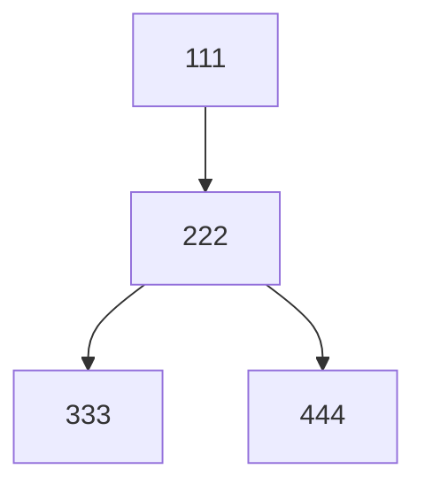
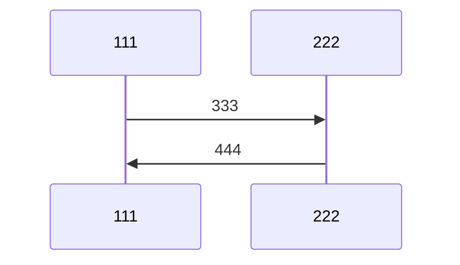

```md
# 1st-GO

---

# 111
## 222
### 333
#### 444
##### 555
###### 666

---

***

___

* * *

---

**111**
__222__
*333*
_444_
***555***
___666__
~~777~~
==888==

`999`
`aaa`
`bbb`

^111^
~222~

<sub>333</sub>
<sup>444</sup>

> 111
>> 222
>>> 333

1. 111
2. 222
3. 333

- 444
- 555
- 666

* 777
* 888
* 999

+ aaa
+ bbb
+ ccc

- [ ] 111
- [x] 222
- [ ] 333

[111](222)


| 111 | 222 | 333 |
|:----|:---:|----:|
| 444 | 555 | 666 |
| 777 | 888 | 999 |

```

aaa
bbb
ccc

```

```python
ddd
eee
fff
```

```javascript
ggg
hhh
iii
```


<ccc@ddd.eee>

111[^1]

::: warning
333
:::

::: info
444
:::

::: tip
555
:::

::: danger
666
:::

<details>
<summary>777</summary>
888
</details>

<kbd>AAA</kbd>
<kbd>BBB</kbd>
<kbd>CCC</kbd>

<mark>DDD</mark>
<small>EEE</small>
<big>FFF</big>

<strong style="color: #ff0000;">GGG</strong>
<em style="color: #0000ff;">HHH</em>
<span style="color: #00ff00;">III</span>

<!-- 这也是注释 -->

x = \frac{-b \pm \sqrt{b^2 - 4ac}}{2a}

\begin{matrix}
111 & 222 \\
333 & 444 \\
\end{matrix}

$a = b + c$






111 222 333
[ ] [x] [-]
[>] [<] [~]

111
: 222

333
: 444

555
: 666

==777==
++888++
^^999^^
~~aaa~~
bbb
^ccc^
~ddd~

<ruby>111<rt>222</rt></ruby>
<ruby>333<rt>444</rt></ruby>

<abbr title="555">666</abbr>
<abbr title="777">888</abbr>

<font color="red">AAA</font>
<font size="5">BBB</font>
<font face="monospace">CCC</font>

<div align="center">DDD</div>
<div align="right">EEE</div>

<center>FFF</center>

<u>GGG</u>
<s>HHH</s>

<progress value="50" max="100"></progress>
<meter value="0.6">60%</meter>

<dl>
<dt>111</dt>
<dd>222</dd>
<dt>333</dt>
<dd>444</dd>
</dl>

<figure>
<figcaption>555</figcaption>
</figure>

<blockquote cite="666">
777
</blockquote>

<cite>888</cite>

<q>999</q>

<ins>AAA</ins>
<del>BBB</del>

<address>CCC</address>

<time datetime="2024-01-01">DDD</time>

<data value="123">EEE</data>

<output>FFF</output>

<var>GGG</var>

<kbd>Ctrl</kbd>+<kbd>C</kbd>

<samp>HHH</samp>

<code>III</code>

<pre>JJJ</pre>

<template>KKK</template>

<slot>LLL</slot>

<canvas width="100" height="100"></canvas>

<svg width="100" height="100">
<circle cx="50" cy="50" r="40" stroke="black" stroke-width="3" fill="red" />
</svg>

<audio controls>
<source src="111.mp3" type="audio/mpeg">
</audio>

<video width="320" height="240" controls>
<source src="222.mp4" type="video/mp4">
</video>

<iframe src="333.html"></iframe>

<embed src="444.pdf" width="500" height="375">

<object data="555.swf" width="400" height="300"></object>

<param name="666" value="777">

<map name="888">
<area shape="rect" coords="0,0,50,50" href="999.html">
</map>

<track src="aaa.vtt" kind="subtitles" srclang="en" label="English">

<source src="bbb.mp4" type="video/mp4">

<picture>
<source media="(min-width:650px)" srcset="ccc.jpg">
<source media="(min-width:465px)" srcset="ddd.jpg">

</picture>

<datalist id="ggg">
<option value="HHH">
<option value="III">
<option value="JJJ">
</datalist>

<keygen name="KKK">

<output name="LLL" for="MMM NNN">OOO</output>

<meter value="2" min="0" max="10">2 out of 10</meter>
<meter value="0.6">60%</meter>

<progress value="75" max="100">75%</progress>

<menu type="toolbar">
<li>
<menu label="PPP">
<button type="button">QQQ</button>
<button type="button">RRR</button>
</menu>
</li>
</menu>

<menuitem type="command" label="SSS">

<dialog open>TTT</dialog>

<details open>
<summary>UUU</summary>
VVV
</details>

<main>WWW</main>

<header>XXX</header>

<footer>YYY</footer>

<nav>ZZZ</nav>

<section>111</section>

<article>222</article>

<aside>333</aside>

<figure>
<figcaption>444</figcaption>
</figure>

<time datetime="2024-01-01">555</time>

<mark>666</mark>

<ruby>
777 <rt>888</rt>
</ruby>

<wbr>

<bdi>999</bdi>

<bdo dir="rtl">AAA</bdo>

<span style="color: red; background-color: yellow; font-size: 20px; font-weight: bold; text-decoration: underline; border: 2px solid blue; padding: 5px; margin: 10px; border-radius: 10px; box-shadow: 3px 3px 5px #888; transform: rotate(5deg);">BBB</span>

<div style="display: flex; justify-content: center; align-items: center; height: 100px; background: linear-gradient(to right, red, yellow);">
<span style="color: white; text-shadow: 2px 2px 4px black;">CCC</span>
</div>

<table style="border-collapse: collapse; width: 100%;">
<tr style="background-color: #f2f2f2;">
<th style="border: 1px solid #ddd; padding: 8px; text-align: left;">DDD</th>
<th style="border: 1px solid #ddd; padding: 8px; text-align: left;">EEE</th>
</tr>
<tr>
<td style="border: 1px solid #ddd; padding: 8px;">FFF</td>
<td style="border: 1px solid #ddd; padding: 8px;">GGG</td>
</tr>
</table>

<marquee direction="left" behavior="scroll" scrollamount="3">HHH</marquee>
<marquee direction="right" behavior="alternate" scrollamount="5">III</marquee>

<blink>JJJ</blink>

<multicol cols="3">
KKK LLL MMM NNN OOO PPP QQQ RRR SSS TTT UUU VVV WWW XXX YYY ZZZ
</multicol>

<spacer type="horizontal" width="50" height="10">
<spacer type="vertical" width="10" height="50">

<isindex prompt="Search: ">

<nextid n="123">

<basefont size="5" color="red" face="Arial">

<dir>
<li>AAA</li>
<li>BBB</li>
<li>CCC</li>
</dir>

<plaintext>
DDD EEE FFF
GGG HHH III

<listing>
JJJ KKK LLL
MMM NNN OOO
</listing>

<xmp>
PPP QQQ RRR
SSS TTT UUU
</xmp>

<noembed>VVV</noembed>

<noframes>WWW</noframes>

<ilayer>XXX</ilayer>

<layer>YYY</layer>

<keygen name="ZZZ">

<applet code="AAA.class" width="300" height="300">
<param name="BBB" value="CCC">
</applet>

<acronym title="DDD">EEE</acronym>

<big>FFF</big>

<center>GGG</center>

<font face="Arial" size="5" color="blue">HHH</font>

<strike>III</strike>

<tt>JJJ</tt>

<frame src="KKK.html">

<frameset cols="50%,50%">
<frame src="LLL.html">
<frame src="MMM.html">
</frameset>

<noscript>NNN</noscript>

<script type="text/javascript">
// OOO
</script>

<style>
body { background-color: #fff; }
</style>

<link rel="stylesheet" href="PPP.css">

<meta charset="UTF-8">
<meta name="description" content="QQQ">
<meta name="keywords" content="RRR, SSS, TTT">
<meta name="author" content="UUU">
